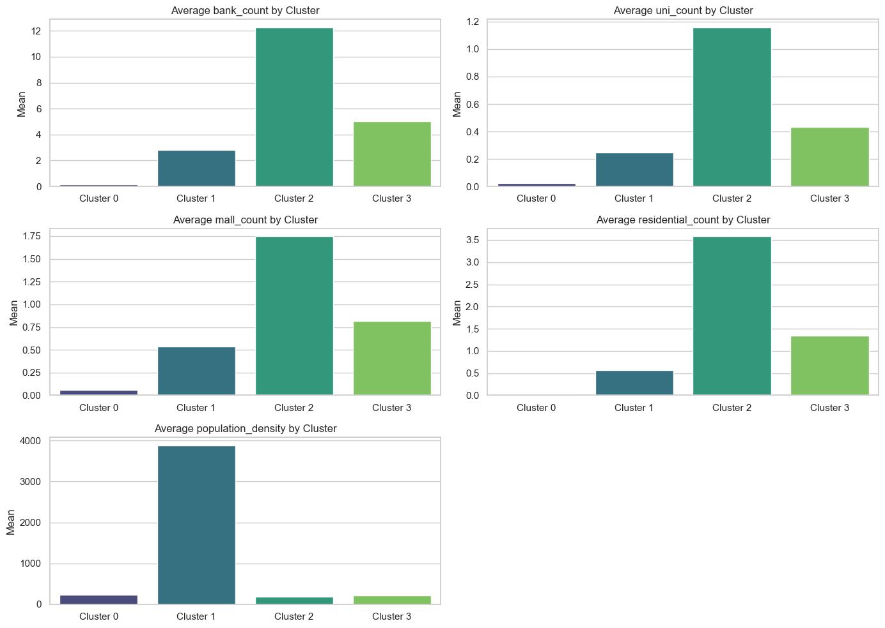

# Poste_Clustring
This project performs clustering of geographic zones (e.g. post office areas) using machine learning, based on nearby facilities and population density. The goal is to identify meaningful groups of zones to support data-driven planning and decision-making.

### Feature Selection
We use the following features:
- `bank_count`
- `uni_count`
- `mall_count`
- `residential_count`
- `population_density`

### Clustering Algorithm
We apply the KMeans clustering algorithm. The value of K was determined using the elbow method.

### Visualization
Below is an example visualization of the clustering results:

Data Sources
Post office locations were geocoded using LocationIQ.
Population density data is based on LandScan, mapped to 1km² grid cells.
Surrounding Infrastructure
Bank, university, mall, and residential counts were extracted using OpenStreetMap Overpass API.

Ps: the results are not accurate bzaf since the locations of dureaux de poste were retrieved from locationIQ population count from landScan for each 1km² and banks locations, universities, malls, residential area from OpenStreetMap(overPass)

⚠️ Disclaimer
While this project provides useful insights, please keep in mind a few limitations related to data sources.
